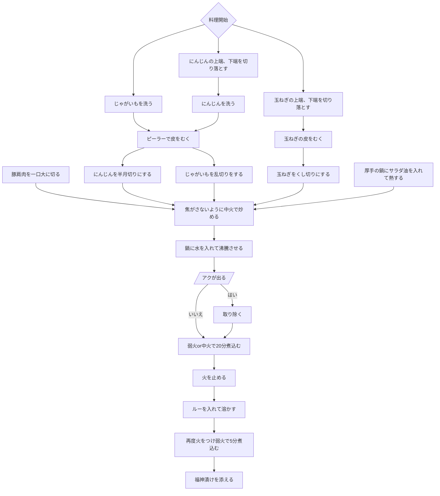

## 私のカレーのレシピ
私のカレーのレシピを公開します！！！

### 手順

```mermaid
flowchart TB
alpha{"料理開始"}
A["じゃがいもを洗う"]
B["にんじんの上端、下端を切り落とす"]
C["玉ねぎの上端、下端を切り落とす"]
D["にんじんを洗う"]
E["玉ねぎの皮をむく"]
F["ピーラーで皮をむく"]
G["豚肩肉を一口大に切る"]
H["にんじんを半月切りにする"]
I["じゃがいもを乱切りをする"]
J["玉ねぎをくし切りにする"]
K["厚手の鍋にサラダ油を入れて熱する"]
L["焦がさないように中火で炒める"]
M["鍋に水を入れて沸騰させる"]
N[/"アクが出る"/]
O["取り除く"]
P["弱火or中火で20分煮込む"]
Q["火を止める"]
R["ルーを入れて溶かす"]
S["再度火をつけ弱火で5分煮込む"]
T["福神漬けを添える"]
alpha --> A
alpha --> B
alpha --> C
B --> D
A --> F
D --> F
C --> E
F --> H
F --> I
E --> J
G --> L
H --> L
I --> L
J --> L
K --> L
L --> M
M --> N
N --はい--> O
N --いいえ--> P
O --> P
P --> Q
Q --> R
R --> S
S --> T
```
